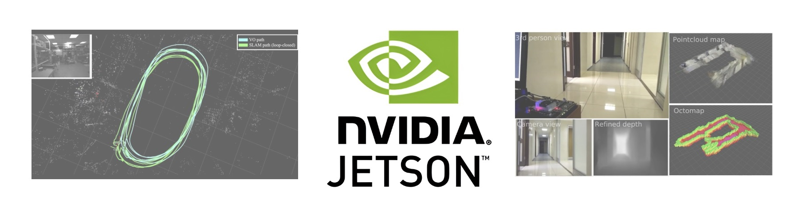

# Intelligent Robot Guide Documentation  
Author : Minsu Kwon (M.S in Dept of AI, University of Seoul)  
 
  

## 📍 Preclaimer
This documentation expects users to have such environment: 
### Platform
* Jetson Xavier NX
* Jetpack 5.1.3 (L4T 35.5.0)
* Python 3.8.10
* Ubuntu 20.04 (linux kernel 5.10)

### Libraries 
* CUDA 11.4.315
* cuDNN 8.6.0.166
* Pytorch 2.1.0
* Torchvision 0.16.1
* OpenCV 4.10.0 with CUDA
* Jetson-inference
 

## 🚀 Table of Contents
|-| Name | Description | Link |
|-|--------|-------------|---------|
| 1 | opencv_videocapture_rtsp | Simple video capture streaming via RTSP using OpenCV and mediamtx | [code](code/01_mediamtx/opencv_videocapture_rtsp.py) |
| 2 | simple_cuda_manipulation | Simple image manipulation with CUDA and jetson-inference package | [code](code/02_jetson_inference/simple_cuda_manipulation.py) |
| 3 | simple_videocapture_rtsp | Simple video capture streaming via RTSP with jetson-inference package | [code](code/02_jetson_inference/simple_videocapture_rtsp.py) |
| 4 | simple_mobilenet_rtsp | Simple MobileNet streaming via RTSP with jetson-inference package | [code](code/02_jetson_inference/simple_mobilenet_rtsp.py) |