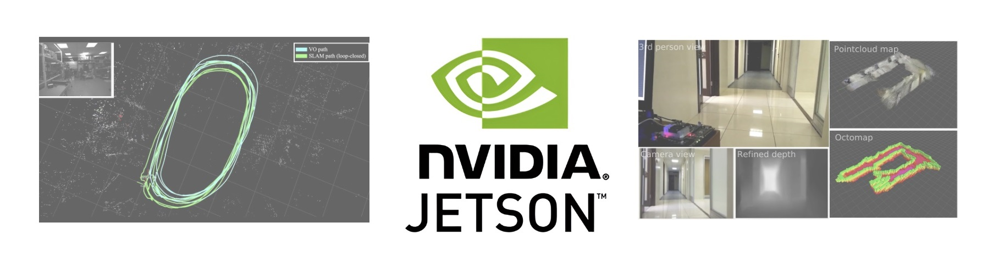

[ [English](#english) | [한국어](#한국어) ]

# Intelligent Robot Guide
Author: Minsu Kwon (M.S in Dept of AI, University of Seoul)  


---

## English

### Useful docs
- 👉 **Install dev packages safely, easily:** [`install_jetson_dev_packages.md`](docs/install_jetson_dev_packages.md)
- 👉 **Safely setup conda venv for jetson:** [`check_jetson_env_conflicts.md`](docs/check_jetson_env_conflicts.md)
- 👉 **Check current conda venv is conflicted:** [`safe_set_pytorch_conda.md`](docs/safe_set_pytorch_conda.md)
- 👉 **Safely link system packages on conda venv :** [`jetson_system_bridge.md`](docs/jetson_system_bridge.md)
- 👉 **Code examples:** [`code/README.md`](code/README.md)

### Prerequisites
- **Hardware**: Jetson Xavier NX  
- **OS**: Ubuntu 20.04 (L4T r35.6.x) / JetPack **5.1.5**  
- **Python**: 3.8  
- **Key libs**:
  - CUDA 11.4 (JetPack)
  - cuDNN 8.x (JetPack)
  - PyTorch 2.1.0 (Jetson wheel)
  - Torchvision 0.16.1 (from source)
  - OpenCV 4.10.0 (CUDA, installed to `/usr/local`)
  - (Optional) DeepStream 6.3

### Quick Start
1) **(Only for UOS class students!)** Wi-Fi (AX210) patch + static IPv4
   ```bash
   cd scripts
   bash ./enable_ax210.sh
   bash ./set_wifi_ipv4.sh                 # prompts SSID/PSK, sets static IPv4
   ```
---
2) Install jetson dev stack (see [`install_jetson_dev_packages.md`](docs/install_jetson_dev_packages.md) for detail)
   ```bash
   bash ./install_jetson_dev_packages.sh   # default 1,2,3,4,5
   ```
3) Safely create PyTorch conda venv for project. **(Recommended!)**
   ```bash
   bash ./safe_set_pytorch_conda.sh              # choose torch 2.1 / 2.0 / 1.14
   bash ./safe_set_pytorch_conda.sh --no-tv      # if not installing torchvision (time-saving)
   ```
4) Check whenever you are doubtful about venv is conflicted - It gives quick solution to resolve the issues
   ```bash
   bash ./check_jetson_env_conflicts.sh
   ```
5) Link system packages on current conda venv again just in the case you accidentally installed opencv-python.
   ```bash
   bash ./jetson_system_bridge.sh
   ```
---

## 한국어

### 참고 문서
- 👉 **개발 패키지 안전·간편 설치:** [`install_jetson_dev_packages.md`](docs/install_jetson_dev_packages.md)
- 👉 **Jetson용 conda 환경 안전 설정:** [`check_jetson_env_conflicts.md`](docs/check_jetson_env_conflicts.md)
- 👉 **현재 conda 환경의 충돌 확인:** [`safe_set_pytorch_conda.md`](docs/safe_set_pytorch_conda.md)
- 👉 **Jetson용 conda에 시스템 패키지를 링크:** [`jetson_system_bridge.md`](docs/jetson_system_bridge.md)
- 👉 **코드 예제:** [`code/README.md`](code/README.md)

### 요구 사항
- **하드웨어**: Jetson Xavier NX  
- **OS**: Ubuntu 20.04 (L4T r35.6.x) / JetPack **5.1.5**  
- **Python**: 3.8  
- **핵심 라이브러리**:
  - CUDA 11.4 (JetPack 기본 제공)
  - cuDNN 8.x (JetPack)
  - PyTorch 2.1.0 (Jetson 전용 휠)
  - Torchvision 0.16.1 (소스 빌드)
  - OpenCV 4.10.0 (CUDA 지원, `/usr/local` 설치)
  - (선택) DeepStream 6.3

### 빠른 시작
1) **(서울시립대 수업 전용)** AX210 Wi‑Fi 패치 + 고정 IPv4
   ```bash
   cd scripts
   bash ./enable_ax210.sh
   bash ./set_wifi_ipv4.sh                 # SSID/PSK 입력받아 고정 IP 설정
   ```
---
2) Jetson 개발 스택 설치 (자세한 내용: [`install_jetson_dev_packages.md`](docs/install_jetson_dev_packages.md))
   ```bash
   bash ./install_jetson_dev_packages.sh   # 기본 1,2,3,4,5 실행
   ```
3) 프로젝트용 PyTorch conda 환경 생성 **(권장)**  
   ```bash
   bash ./safe_set_pytorch_conda.sh              # torch 2.1 / 2.0 / 1.14 선택
   bash ./safe_set_pytorch_conda.sh --no-tv      # torchvision 미설치 (시간 절약)
   ```
4) 현재 conda 환경이 충돌을 일으키는지 확인하기 - 문제에 대한 빠른 해결 제공
   ```bash
   bash ./check_jetson_env_conflicts.sh
   ```
5) 실수로 opencv-python 등을 설치했을 때, 현재 conda 환경에 시스템 패키지를 다시 링크하기  
   ```bash
   bash ./jetson_system_bridge.sh
   ```
---
